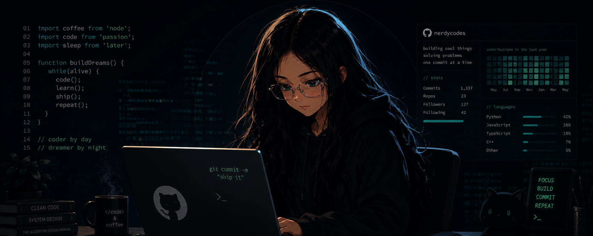

# Hi there! I'm Supreet 👋

### AI Engineer in making · Full Stack Developer · Building real AI products, not just demos

  

---

## 👩‍💻 About Me

I'm **Supreet Mohapatra**, a CSE undergrad from India building at the intersection of **applied AI and full-stack development**.

I build things that actually work — RAG pipelines, computer vision systems, NLP tools, and AI-integrated web apps. Currently deepening my **DSA & system design** skills for placement 2027 while shipping real projects.

### ⚡ Right now
- Building **DocMind-AI** — AI-powered PDF platform with semantic search & vector retrieval
- Grinding **DSA daily** on [LeetCode](https://leetcode.com/u/DevHime) (Java) · tracking progress in [DSA-series](https://github.com/Supreet37/DSA-series)
- Learning **system design** fundamentals
- Writing about what I build on [Medium](http://www.medium.com/@supreetmohapatra06) & [DEV.to](https://www.dev.to/supreet37)

---

- 🌍 Based in India (Odisha)
- ✉️ [supreetmohapatra06@gmail.com](mailto:supreetmohapatra06@gmail.com)
- 🤝 Open to collaborating on AI-integrated apps and open source
- 💬 Fun fact: *"I'm secretly Shuri from Wakanda — mixing tech brilliance with sharp debating skills."*

---

## 🛠️ What I actually work with

### Languages

### Frontend

### Backend & APIs

### Databases

### Deployment & Cloud

### AI / ML

### Tools

---

## 🚀 Featured Projects

### 🧠 AI & ML

| Project | What it does | Stack |
|---|---|---|
| [hallucination-detector](https://github.com/Supreet37/hallucination-detector) | Chrome extension + FastAPI backend that detects AI hallucinations using NLI models | `Python` `FastAPI` `NLP` `Chrome Extension` `Gemini` |
| [math-solver-cnn](https://github.com/Supreet37/math-solver-cnn) | Solves handwritten math expressions — CNN on MNIST + OpenCV segmentation pipeline | `Python` `TensorFlow` `Keras` `OpenCV` `CNN` |
| [DocMind-AI](https://github.com/Supreet37/DocMind-AI) | AI PDF platform with semantic search, summaries, flashcards & document chat | `TypeScript` `Gemini API` `Semantic Search` |
| [baby-cry-analyzer](https://github.com/Supreet37/baby-cry-analyzer) | Classifies infant cries (hunger, pain, tiredness) from audio using ML | `Python` `TypeScript` `ML` `Deep Learning` |
| [AI-Text-Detector](https://github.com/Supreet37/AI-Text-Detector) | Detects AI-generated vs human-written text using logistic regression + TF-IDF | `Python` `scikit-learn` `NLTK` `NLP` |
| [Smart-attendance-system](https://github.com/Supreet37/Smart-attendance-system) | Face recognition + voice verification + GPS-based attendance automation | `Python` `OpenCV` `Pillow` `Voice Recognition` |
| [Friday-ai](https://github.com/Supreet37/Friday-ai) | Voice-enabled AI desktop assistant with a web interface, inspired by Iron Man's FRIDAY | `Python` `JS` `TTS` `HTML/CSS` |

### 🌐 Full Stack & Frontend

| Project | What it does | Stack |
|---|---|---|
| [CodeBridge](https://code-bridgeeducation.netlify.app/) | Learning & internship platform with student/admin flows, cart, events | `React` `Vite` `Tailwind` `Axios` |
| [EcoHub](https://github.com/Supreet37/EcoHub) | Carbon footprint & sustainability tracking platform | `React` `JavaScript` `Vite` |
| [figma-to-website](https://github.com/Supreet37/figma-to-website) | 5 Figma-to-code projects — SaaS, landing pages, dashboards | `HTML` `CSS` `JS` |

### 📚 Learning in Public

| Project | What it does |
|---|---|
| [DSA-series](https://github.com/Supreet37/DSA-series) | My daily DSA grind — LeetCode problems, patterns, notes in Java |
| [Python-Mini-Projects](https://github.com/Supreet37/Python-Mini-Projects) | 25+ Python projects covering automation, web scraping & utilities |

---

## 🌐 Socials

&nbsp;
&nbsp;
&nbsp;
&nbsp;
&nbsp;

---

## 📊 GitHub Stats

