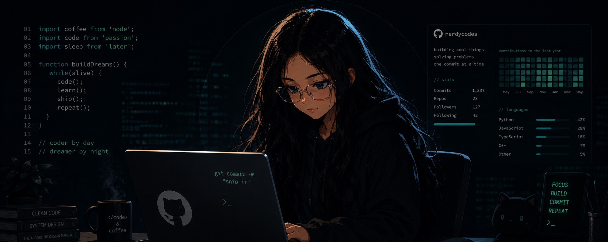
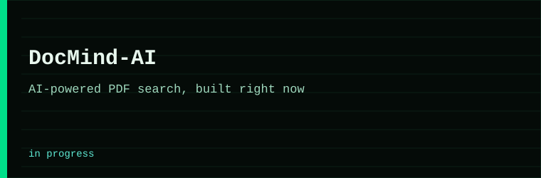
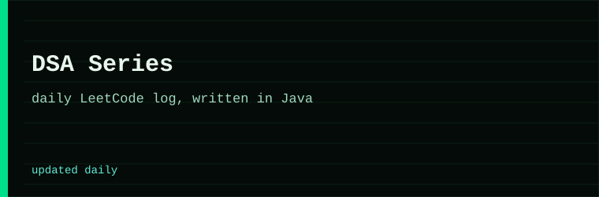
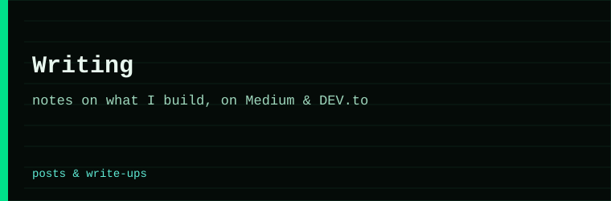
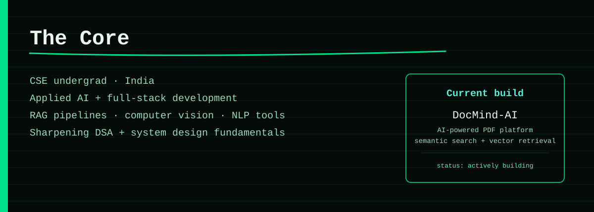
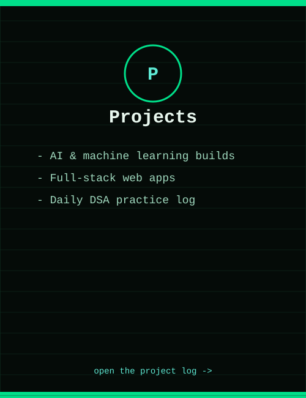
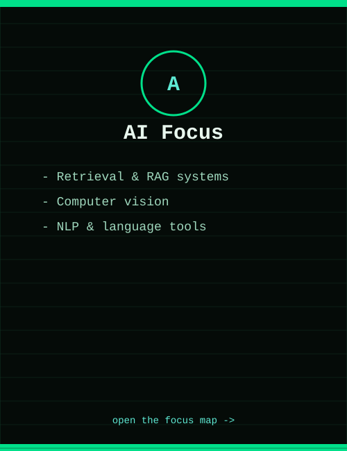

  

<!-- Title -->
<h3 align="center">
    <samp>
        &gt; Hi there!, I am
        <b>Supreet Mohapatra</b>
    </samp>
</h3>

<samp>
「 AI Engineer in the making · Full Stack Developer · Building real AI products, not just demos 」
</samp>

  
  

<!-- Title -->

  

# 🛠 Technologies, Projects, and Focus Areas

<h3>🛠 What I Work With</h3>
 

<!-- 

<b>Languages</b>
 -->

<!-- 
 -->
<!-- 
 -->

<!-- 

<b>Frontend</b>
 -->

<!-- 
 -->

<!-- 
 -->

<!-- 
 -->

<!-- 

<b>Backend & APIs</b>
 -->
<!--  

 -->

<!-- 
 -->

<!-- 

<b>Databases</b>
 -->
<!--  

 -->

<!-- 
 -->

<!-- 

<b>Deployment & Cloud</b>
 -->
<!--  

 -->

<!-- 
 -->

<!-- 

<b>AI / ML</b>
 -->
<!--   -->

<!-- 
 -->

<!-- 
 -->

<!-- 

<b>Tools</b>
 -->
<!--  

 -->

<!-- 
 -->

<table align="center" width="100%">
  <tr>
    <td align="center" valign="top">
      <h4>🧪 Projects</h4>
      
    </td>
    <td align="center" valign="top">
      <h4>🧠 AI Focus</h4>
      
    </td>
  </tr>
</table>

### 📊 Vital Statistics

  

  

  

⚡ Building real AI products — RAG, computer vision, and NLP that actually run

Star ⭐ the repos if they helped you!

  

