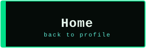
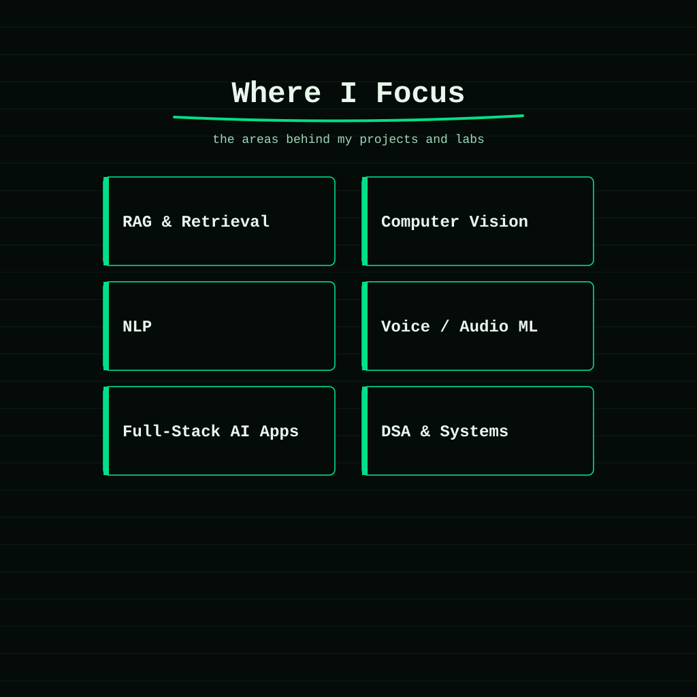
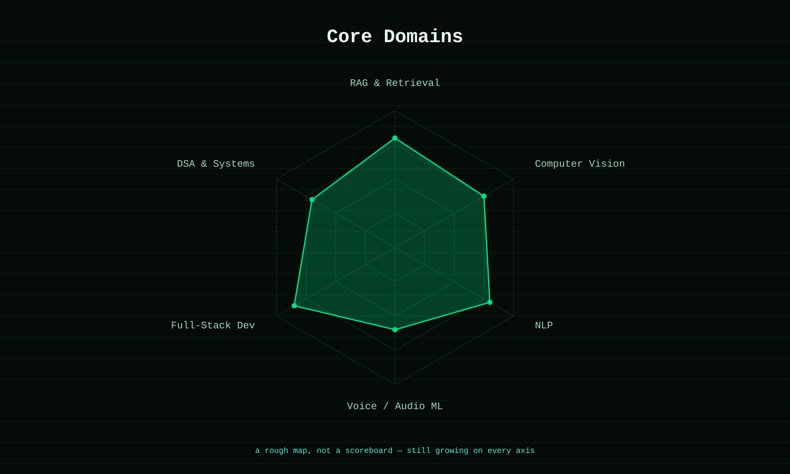
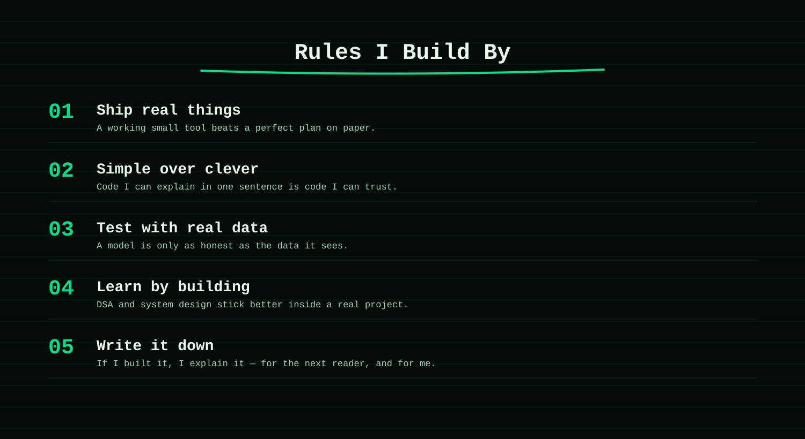

  

  
  
  

  
  
  

---

  <b>The AI areas I care about most are the ones I can actually build and test, not just read about.</b>

  This page maps the technical areas behind my projects: retrieval-augmented generation, computer vision, NLP, and the full-stack work that turns a model into something people can use.

    

## Core Domains

  

## What I'm Building In

| Area | Where it shows up |
| --- | --- |
| RAG & Retrieval | DocMind-AI — semantic search and vector retrieval over PDFs |
| Computer Vision | Smart-attendance-system — face recognition for automated attendance |
| NLP | hallucination-detector — NLI models that catch false AI claims |
| Voice / Audio ML | baby-cry-analyzer, Friday-ai — audio classification and TTS |
| Full-Stack AI Apps | Turning each model above into something with a real interface |
| DSA & Systems | Daily practice, so the systems behind these apps hold up at scale |

## Engineering Principles

  

