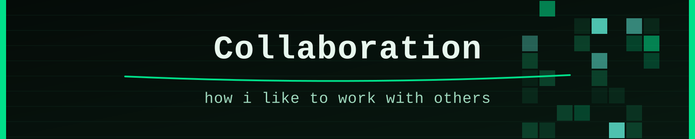
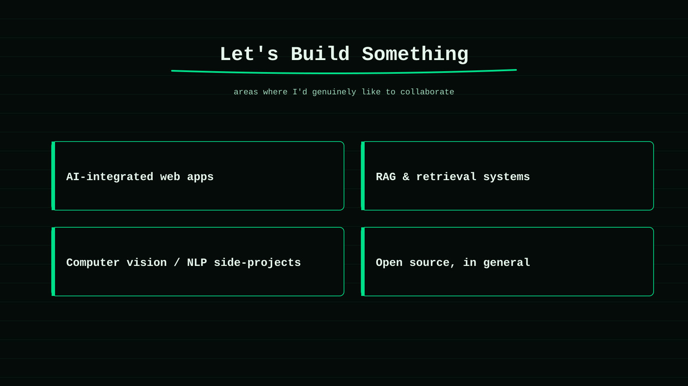

  

  
  
  

  
  
  

---

  <b>Collaboration is most fun for me when there's a real, small problem to chew on — not just an idea.</b>

  I'm especially interested in AI-integrated web apps, RAG and retrieval systems, computer vision, NLP, and open source in general.

  

---

## Collaboration Protocol

I like collaborations where the idea can survive contact with actual code. That usually means there's a concrete problem, a visible first step, and room for me to learn something along the way.

| Signal | What it means |
| --- | --- |
| `BUILD` | There's a real thing to design, implement, test, or improve. |
| `LEARN` | The project stretches a skill I'm actively working on. |
| `SHIP` | There's a clear, small first milestone — not just a vague direction. |
| `OPEN SOURCE` | The project benefits from public docs, clean code, and a clear README. |

## Where I'd Like To Help

### AI-Integrated Web Apps

Turning a model into something with a real interface — search, retrieval, chat, or automation, wired into a working front end.

### RAG & Retrieval Systems

Semantic search, vector stores, and pipelines that make a pile of documents actually answerable.

### Open Source

Fixing bugs, improving docs, or adding a feature to a project I actually use. I'd rather start small and useful than big and vague.

## Contact

If the idea connects to AI apps, RAG, NLP, or open source, send it through the channels in the main [README](../README.md#-contact).

Useful links:

- [Projects](./PROJECTS.md)
- [AI Focus Areas](./AI_DOMAIN.md)
- [Main Profile](../README.md)

---

# 🐍 Contribution Journey

  

This snake animation updates itself once you add the <a href="https://github.com/Platane/snk">snk GitHub Action</a> to your own repo.
