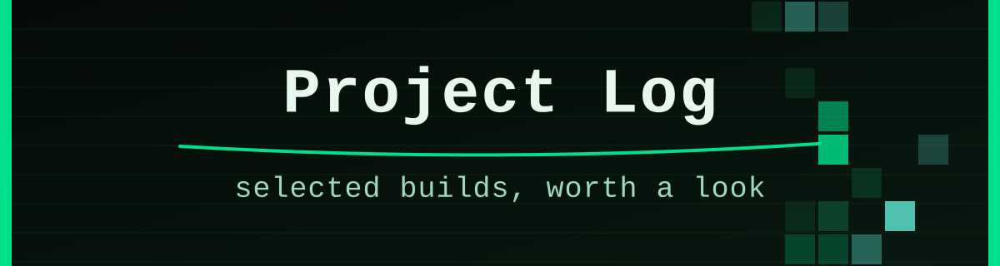
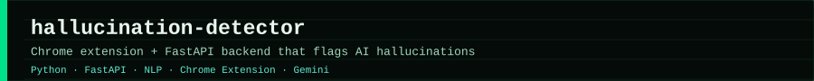
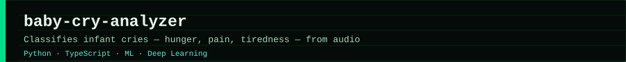
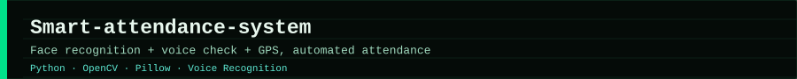
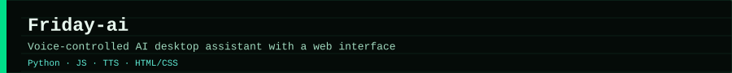
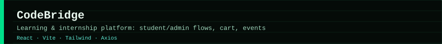
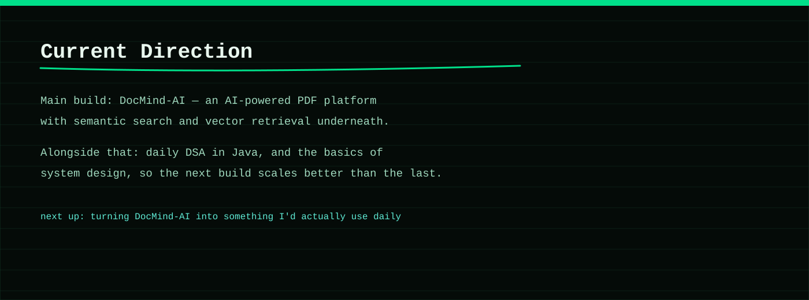
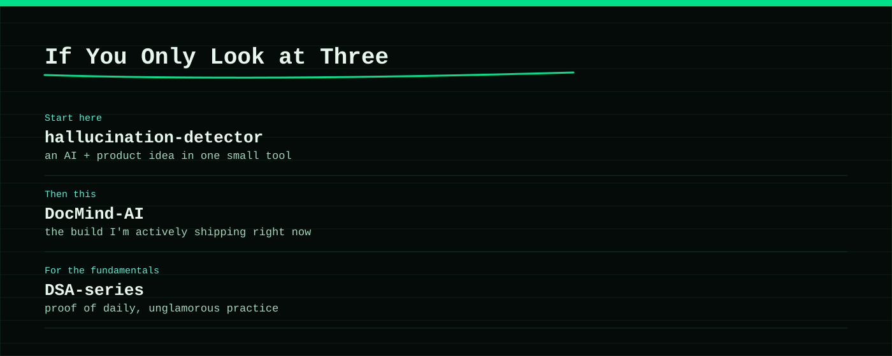

  

  
  
  

  
  
  

---

  <b>Real projects across AI tools, computer vision, NLP, and full-stack web apps.</b>

  This page covers the projects that best show the direction of my profile: AI-integrated apps, models trained on real data, and web apps that people can actually use.

<h2 align="center">🧪 Project Highlights</h2>

<!-- Row 1 -->

  
  

<!-- Row 2 -->

  
  

<!-- Row 3 -->

  
  

## Project Index

| Project | Focus | Status | Why it matters |
| --- | --- | --- | --- |
| [hallucination-detector](https://github.com/Supreet37/hallucination-detector) | Chrome extension + FastAPI, NLI models | Shipped | Catches AI hallucinations right where people read AI output. |
| [baby-cry-analyzer](https://github.com/Supreet37/baby-cry-analyzer) | Audio classification, deep learning | Shipped | Turns a hard-to-read signal (a baby's cry) into something useful. |
| [Smart-attendance-system](https://github.com/Supreet37/Smart-attendance-system) | Face recognition, voice, GPS | Shipped | Automates a boring task with three checks instead of one. |
| [Friday-ai](https://github.com/Supreet37/Friday-ai) | Voice assistant, TTS, desktop + web | Shipped | A full voice-driven assistant, not just a chatbot demo. |
| [CodeBridge](https://code-bridgeeducation.netlify.app/) | React, learning/internship platform | Shipped | Real student/admin flows, a cart, and events — a full product shape. |
| [EcoHub](https://github.com/Supreet37/EcoHub) | React, sustainability tracking | Shipped | Practical carbon-footprint tracking, built to actually be used. |

## Current Direction

  

## What To Look At First

  

---

<h2 align="center">📊 Activity</h2>

  

  

  
  

